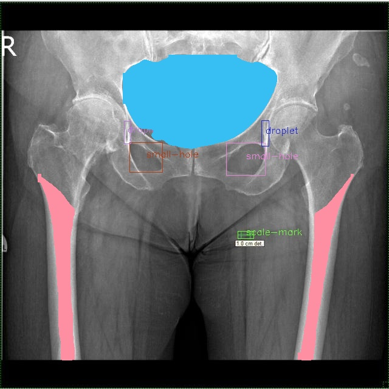
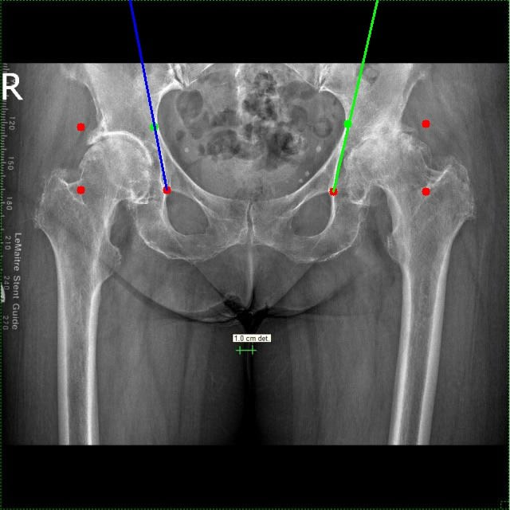
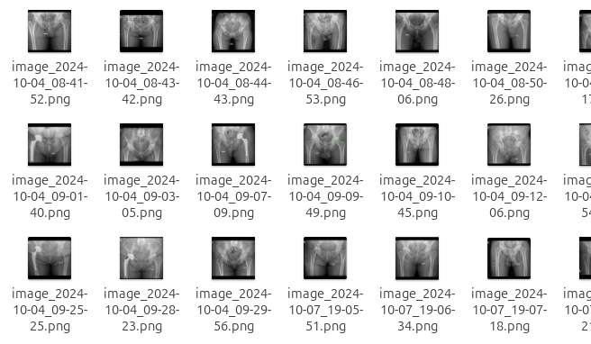
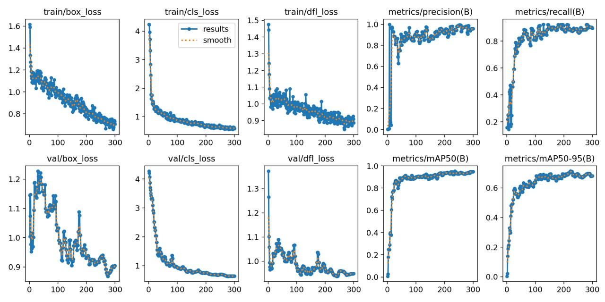

# Hip prosthesis segmentation

## This repository contains the code for the project "X-ray image segmentation"

Team members:
- Iryna Voitsitska
- [Taras Lysun](https://github.com/taraslysun)
- [Sviatoslav Stehnii](https://github.com/sviatoslavstehnii)

## Project description
The goal of this project is to create a model and additional functionality to segment X-ray images of hip and calculate the size of potential prosthesis using methods of computer vision and deep learning. 

## Results of different models and keypoints

Segmentation | Keypoints
--- | ---
|
## Installation
To install the required packages, run the following command:
```bash
pip install -r requirements.txt
```
**Currently the inference is not available due to free plan limitations of Roboflow :) But you can open the `demo.ipynb` to see the results of the model.**

## Data
The dataset used in this project consists of over 50 different X-ray scans which we labeled manually, after consulting with a therapist. Dataset was created using Roboflow platform, which made the training of the model much easier. For the sake of confidentiality, we cannot share the dataset publicly. But in the test_data folder there are some examples of the images we used for training.


## Model
The model we used for segmentation is a very popular YOLO. We fine-tuned the model, and here are some metrics we got:

